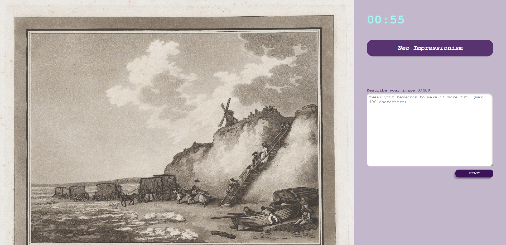

# Introduction 🖼️
In our game ENVISAGE, you and your friends can compete against each other over multiple rounds to create the best AI generated masterpieces. At the beginning of the first round, you are given a picture from the category you choose and an image style as a requirement. 
Your task is to generate an image as close as possible to the requirements. At the end of each round, you get to vote on your favorite picture (not your own!) and the best picture is given as the prompt for the next round with a different style requirement. The process continues till the final round is completed and a winner is declared based on the accumulated votes.

# Technologies used
* Frontend: React, CSS, HTML
* Backend: Stomp (websockets)
* API: [DALL-E](https://platform.openai.com/docs/api-reference/introduction), [Met Collection API](https://metmuseum.github.io/)
* Hosted on GCP

# High-level components
1. [Landing Page](https://github.com/sopra-fs23-group-15/envisage-client/blob/main/src/components/views/LandingPage.js): This is the page users are greeted with when they want to play our game or click the url for our webapp. From this page users can either join an existing lobby or create a new lobby.
2. [Lobbies](https://github.com/sopra-fs23-group-15/envisage-client/blob/main/src/components/views/Lobbies.js) [[Lobby creation](https://github.com/sopra-fs23-group-15/envisage-client/blob/main/src/components/views/LobbyCreation.js), [Lobby configuration](https://github.com/sopra-fs23-group-15/envisage-client/blob/main/src/components/views/LobbyConfiguration.js),[Lobby after](https://github.com/sopra-fs23-group-15/envisage-client/blob/main/src/components/views/LobbiesAfter.js)]: This view and the views in the brackets are similar to each other and handle various cases of the lobby view while paying the game. Lobby is essentially a collection of players, games and rounds. Different lobbies are separate from each other. LobbyCreation allows you to create a (default) lobby. LobbyConfiguration allows you to configure your lobby before you create it. Once the minimum number of players join the lobby the lobby creator can start the game. Until then they are in the lobby waiting area. Players also wait in the lobby waiting area during the process of voting - LobbiesAfter view. Unless everyone votes the game does not move forward.
3. [Game View](https://github.com/sopra-fs23-group-15/envisage-client/blob/main/src/components/views/Games.js) [[Vote View](https://github.com/sopra-fs23-group-15/envisage-client/blob/main/src/components/views/VotePage.js), [Final View](https://github.com/sopra-fs23-group-15/envisage-client/blob/main/src/components/views/FinalPage.js)]: Game is the most important component. It handles the timer, prompt submission and getting the challenge object. After one round until all the players have submitted their prompt, Game view navigates to Voting view where players can vote for the images they like (except their own). In this fashion, after the configured number of rounds (from Lobby configuration) are played, the players see the Final view where they see the winner and the scoreboard.
4. [Exhibition View](https://github.com/sopra-fs23-group-15/envisage-client/blob/main/src/components/views/ExhibitionPage.js) [[Winning Images view](https://github.com/sopra-fs23-group-15/envisage-client/blob/main/src/components/views/WinningImages.js)]: This is the view that players can navigate to if they want to see the images that they created. WinningImages view is another similar view that players can navigate to if they instead want to see the winning images from each round.


# Launch & Deployment
**GCP Deployment**
1. Create two projects for your client and server apps in the Google Cloud web interface.
After successful creation of the projects, make sure to perform
the following steps for the client and server projects, respectively.
2. Using the navigation menu in the top left (select “More Products”), navigate to “IAM &
Admin > Service Accounts” in your Google Cloud dashboard. Create a new service account
and grant it “Editor” role. Next, create a key (“Actions > Manage keys > Add key > Create
new key”) for this service account with type “JSON”.
3. Navigate to “App Engine” and create a new “Application”. Make sure to pick a suitable
region (e.g., “europe-west6”) and select the service account from the previous step.
4. Next, navigate to “APIs & Services”. Enable the “Cloud Build API” and the “App Engine
Admin API”.
5. On GitHub, for both client and server repositories, go to “Settings > Secret and variables >
Actions > New repository secret” tab from the menu on the left and add the content of the
downloaded JSON service account key as GCP_SERVICE_CREDENTIALS.
6. At this point, when you push code to your “main” branch on GitHub, it will try to automatically deploy to Google App Engine. The GitHub action which pushes your code to Google
Cloud is configured in .github/workflows/main.yml.
7. After your first deployment attempt, you can monitor its progress under “Actions” on
GitHub and under “Cloud Build” on the Google Cloud Platform.
8. Once the server is deployed successfully, make sure to copy the URL of the server applica-
tion from the Google App Engine dashboard, add it to src/helpers/getDomain.js in
the client repository, and re(-deploy) the client. If the server URL is incorrect or missing,
you might see an alert “The server cannot be reached. Did you start it?” when trying to
login.
9. On Google Cloud, invite your team members by navigating to “IAM & Admin > IAM >
Grant Access”. Enter the email addresses of your peers as “New Principals”.

**Dalle API Key**
* Add as a secret key to GitHub on the server side - current approach: Settings -> Secrets & Variables -> Actions -> New Repository Secret
* Another option is to use Google Secret Manager

**Local Development**
```bash
git clone git@github.com:sopra-fs23-group-15/envisage-client.git
cd envisage-client
npm install
npm run dev
```

# Illustrations
The following is a representation of how players would interact with the webapp by showing the possibilities of how they move from one view/state to the other.

The most important views of the webapp are -
| View | Screenshot |
| --- | --- |
| Landing Page |  |
| Lobby |  |
| Game |  |
| Vote |  |
| Winner |  |
| Exhibition |  |

# Roadmap 
* Play with anyone in the world by introducing waiting lobbies
* Ability to download your images
* Accounts to save player stats and their generated images
* Disappearing Mode (images disappear after a while and are not displayed for the entire round duration)

# Authors and acknowledgment 
* Marion Andermatt - [marion-an](https://github.com/marion-an)
* Moritz Mohn - [moritzmohn](https://github.com/moritzmohn)
* Nikita Amitabh - [nikita-uzh](https://github.com/nikita-uzh)
* Shantam Raj - [armsp](https://github.com/armsp)
* Xue Wang - [xueswang](https://github.com/xueswang)

We would also like to thank our mentor Valentin Hollenstein - [v4lentin1879](https://github.com/v4lentin1879) for supporting us throughout the project.

# License
[Apache-2.0 license](https://github.com/sopra-fs23-group-15/envisage-client/blob/main/LICENSE)
