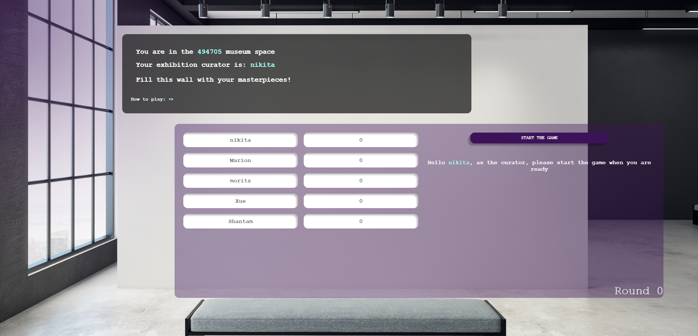
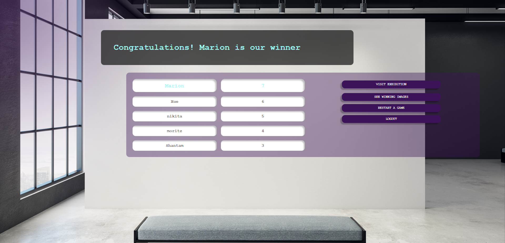

# Envisage


## Introduction 
In ENVISAGE, you and your friends can compete against each other over multiple rounds to create the best AI generated masterpieces. At the beginning of the first round, you are given a picture from the category you choose and an image style as a requirement. 
Your task is to generate an image as close as possible to the requirements. At the end of each round, you get to vote on your favorite picture (not your own!) and the best picture is given as the prompt for the next round with a different style requirement. The process continues till the final round is completed and a winner is declared based on the accumulated votes.


## Technologies
* Frontend: React, CSS, HTML
* Backend: Stomp (websockets)
* API: [DALL-E](https://platform.openai.com/docs/api-reference/introduction), [Met Collection API](https://metmuseum.github.io/)
* Hosted on GCP


## High-level components
### [Landing Page](https://github.com/sopra-fs23-group-15/envisage-client/blob/main/src/components/views/LandingPage.js): 
This is the page users land on when they want to play our game or click the url for our webapp. From this page users can either join an existing lobby or create a new lobby.
### [Lobbies](https://github.com/sopra-fs23-group-15/envisage-client/blob/main/src/components/views/Lobbies.js) [[Lobby creation](https://github.com/sopra-fs23-group-15/envisage-client/blob/main/src/components/views/LobbyCreation.js), [Lobby configuration](https://github.com/sopra-fs23-group-15/envisage-client/blob/main/src/components/views/LobbyConfiguration.js), [Lobby after](https://github.com/sopra-fs23-group-15/envisage-client/blob/main/src/components/views/LobbiesAfter.js)]: 
This view and the views in the brackets are similar to each other and handle various cases of the lobby view while playing the game. Lobby is essentially a collection of players, games and rounds. Different lobbies are separate from each other. LobbyCreation allows you to create a (default) lobby. LobbyConfiguration allows you to configure your lobby before you create it. Once the minimum number of players join the lobby the lobby creator can start the game. Until then they are in the lobby waiting area. Players also wait in the lobby waiting area during the process of voting - LobbiesAfter view. Unless everyone votes the game does not move forward.
### [Game View](https://github.com/sopra-fs23-group-15/envisage-client/blob/main/src/components/views/Games.js) [[Vote View](https://github.com/sopra-fs23-group-15/envisage-client/blob/main/src/components/views/VotePage.js), [Final View](https://github.com/sopra-fs23-group-15/envisage-client/blob/main/src/components/views/FinalPage.js)]: 
Game is the most important component. It handles the timer, prompt submission and getting the challenge object. After one round until all the players have submitted their prompt, Game view navigates to Voting view where players can vote for the images they like (except their own). In this fashion, after the configured number of rounds (from Lobby configuration) are played, the players see the Final view where they see the winner and the scoreboard.
### [Exhibition View](https://github.com/sopra-fs23-group-15/envisage-client/blob/main/src/components/views/ExhibitionPage.js) [[Winning Images view](https://github.com/sopra-fs23-group-15/envisage-client/blob/main/src/components/views/WinningImages.js)]: 
This is the view that players can navigate to if they want to see the images that they created. WinningImages view is another similar view that players can navigate to if they instead want to see the winning images from each round.


## Launch & Deployment
### Prerequisites
Clone the client repository:

```bash
git clone git@github.com:sopra-fs23-group-15/envisage-client.git
```

For your local development environment, you will need [Node.js](https://nodejs.org). All other dependencies, including React, get installed with:

```bash
npm install
```

Run this command before you start your application for the first time. Next, you can start the app with:

```bash
npm run dev
```

After these steps you can open [http://localhost:3000](http://localhost:3000) in your browser to view it.

**_Use different browsers to play the game locally_**

### Testing
Run the tests with:

```bash
npm run test
```

> For macOS user running into a 'fsevents' error: https://github.com/jest-community/vscode-jest/issues/423

### Build
Run the following command to build the application:

```bash
npm run build
``` 

### Deployment
The app is hosted on Google App Engine. A push to the main will automatically lead to the deployment to the Google App Engine.


## Illustrations
The following diagram shows the flow of our interfaces.

<p align="center">
 
</p>

### LandingPage
<p align="center">
  
</p>

### Lobbies
<p align="center">
  
</p>

### Games
<p align="center">
  
</p>

### VotePage
<p align="center">
  
</p>

### LobbiesAfter
<p align="center">
  
</p>

### FinalPage
<p align="center">
  
</p>

### WinningImages
<p align="center">
  
</p>

### ExibithionPage
<p align="center">
  
</p>


## Roadmap 
* Play with anyone in the world by introducing waiting lobbies
* Ability to download your images
* Accounts to save player stats and their generated images
* Disappearing Mode (images disappear after a while and are not displayed for the entire round duration)

## Authors and acknowledgment 
* Marion Andermatt - [marion-an](https://github.com/marion-an)
* Moritz Mohn - [moritzmohn](https://github.com/moritzmohn)
* Nikita Amitabh - [nikita-uzh](https://github.com/nikita-uzh)
* Shantam Raj - [armsp](https://github.com/armsp)
* Xue Wang - [xueswang](https://github.com/xueswang)

We would like to thank our mentor Valentin Hollenstein - [v4lentin1879](https://github.com/v4lentin1879) for supporting us throughout the project.

## License
This project is licensed under [Apache-2.0 license](https://github.com/sopra-fs23-group-15/envisage-client/blob/main/LICENSE)
