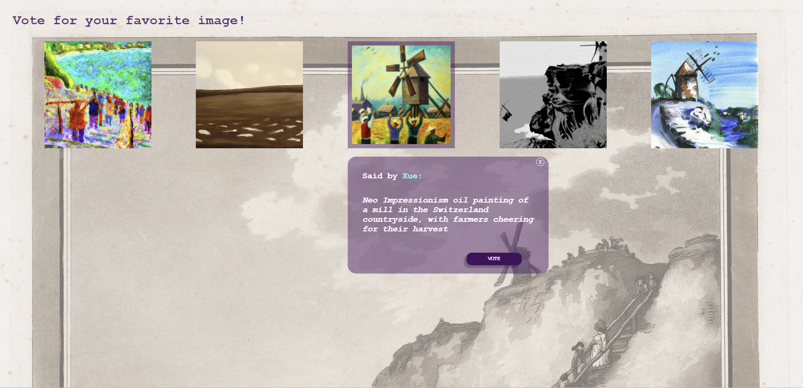
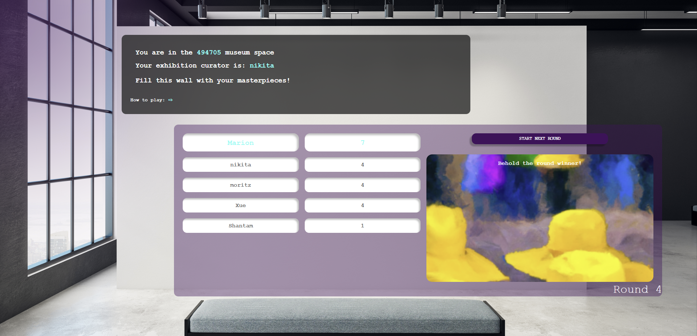

# Envisage


## Introduction 
In ENVISAGE, you and your friends can compete against each other over multiple rounds to create the best AI generated masterpieces. At the beginning of the first round, you are given a picture from the category you choose and an image style as a requirement. Your task is to generate an image as close as possible to the requirements. At the end of each round, you get to vote on your favorite picture (not your own!) and the best picture is given as the prompt for the next round with a different style requirement. The process continues till the final round is completed and a winner is declared based on the accumulated votes.

You can play Envisage [here](https://sopra-fs23-group-15-client.oa.r.appspot.com/landingPage).

## Technologies
* React
* CSS
* HTML
* JavaScript
* APIs: [DALL-E](https://platform.openai.com/docs/api-reference/introduction), [Met Collection API](https://metmuseum.github.io/)
* Hosted on GCP


## High-level components
### [Landing Page](https://github.com/sopra-fs23-group-15/envisage-client/blob/main/src/components/views/LandingPage.js)
Where it all begins - You can choose to either join an existing lobby or [create new lobby](https://github.com/sopra-fs23-group-15/envisage-client/blob/main/src/components/views/LobbyCreation.js). On the [lobby configuration page](https://github.com/sopra-fs23-group-15/envisage-client/blob/main/src/components/views/LobbyConfiguration.js) a lobby can be customized to your liking. An explanation of how the game works can be found on each of the three pages by clicking on the blue arrow beneath the slide show.

### [Lobby](https://github.com/sopra-fs23-group-15/envisage-client/blob/main/src/components/views/Lobbies.js)
Everything related to lobbies - As a player of ENVISAGE, you can create a default lobby and claim the "control" over the lobby - each round of the game will then be started by you. All other non-lobby-creators can see the updating status of the lobby (for example how many more people needed to start a game) and wait for the lobby creator to start the game. Further, during the waiting periods before and after voting, you are in a [waiting lobby area](https://github.com/sopra-fs23-group-15/envisage-client/blob/main/src/components/views/LobbiesAfter.js), where the scoreboard is being refreshed dynamically. At the end of the game, the looby will present a [final scoreboard](https://github.com/sopra-fs23-group-15/envisage-client/blob/main/src/components/views/FinalPage.js), with the winners (or multiple winners) declared.

### [Game](https://github.com/sopra-fs23-group-15/envisage-client/blob/main/src/components/views/Games.js)
The most important component - On the game page you can describe the given image taking the style requirement into account. After submitting your text, you will by navigated to the [voting page](https://github.com/sopra-fs23-group-15/envisage-client/blob/main/src/components/views/VotePage.js). On the vote page you get to vote on the images of your co-players after each round, not your own ofc! Make sure to accumulate votes to increase your score and potentially be the winner displayed at the very end on top of the scoreboard.

### [Exhibition](https://github.com/sopra-fs23-group-15/envisage-client/blob/main/src/components/views/ExhibitionPage.js) and [Winning Images](https://github.com/sopra-fs23-group-15/envisage-client/blob/main/src/components/views/WinningImages.js) 
In the exhibition view at the end of the game, you can see all images which were generated with your inputs. In the winning image view, the winning image of each round is displayed.


## Launch & Deployment
### Prerequisites
Clone the client repository:

```bash
git clone git@github.com:sopra-fs23-group-15/envisage-client.git
```

For your local development environment, you will need [Node.js](https://nodejs.org). All other dependencies, including React, get installed with:

```bash
npm install
```

The following library needs to be installed as well:
```bash
npm install @mui/icons-material @mui/material @emotion/styled @emotion/react
````


Run this command before you start your application for the first time. Next, you can start the app with:

```bash
npm run dev
```

After these steps you can open [http://localhost:3000](http://localhost:3000) in your browser to view it.

**_Use different browsers to play the game locally_**

### Testing
Run the tests with:

```bash
npm run test
```

> For macOS user running into a 'fsevents' error: https://github.com/jest-community/vscode-jest/issues/423

### Build
Run the following command to build the application:

```bash
npm run build
``` 

### Deployment
The app is hosted on Google App Engine. A push to the main will automatically lead to the deployment to the Google App Engine.


## Illustrations
The following diagram shows the flow of our interfaces.

<p align="center">
 
</p>

### Landing Page
<p align="center">
  
</p>

### Lobby
<p align="center">
  
</p>

### Game
<p align="center">
  
</p>

### Voting
<p align="center">
  
</p>

### Waiting Lobby
<p align="center">
  
</p>

### Winner Announcement (Final Page)
<p align="center">
  
</p>

### Winning Images
<p align="center">
  
</p>

### Exhibition
<p align="center">
  
</p>


## Roadmap 
* Play with anyone in the world by introducing waiting lobbies
* Ability to download your images
* Accounts to save player stats and their generated images
* Disappearing Mode (images disappear after a while and are not displayed for the entire round duration)

## Authors and acknowledgment 
* Marion Andermatt - [marion-an](https://github.com/marion-an)
* Moritz Mohn - [moritzmohn](https://github.com/moritzmohn)
* Nikita Amitabh - [nikita-uzh](https://github.com/nikita-uzh)
* Shantam Raj - [armsp](https://github.com/armsp)
* Xue Wang - [xueswang](https://github.com/xueswang)

We would like to thank our mentor Valentin Hollenstein - [v4lentin1879](https://github.com/v4lentin1879) for supporting us throughout the project.

## License
This project is licensed under [Apache-2.0 license](https://github.com/sopra-fs23-group-15/envisage-client/blob/main/LICENSE).
