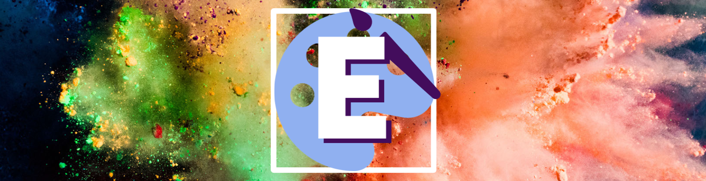

# Envisage



## Introduction 
In our game ENVISAGE, we wrap “prompt making” and “creative actions” into a fun process with the help of DALL-E, such that “drawing becomes describing.” Our game is an iterative and dynamic journey to witness the “evolution” of an original idea. An image (from the MET museum art collections) together with a style requirement (could be an influential artist’s name, or a famous art movement in history) are fed to the players as the starting point, and the players describe this image with keywords. This is where creativity and a little bit of artistic sense key in. Players can choose to describe the image with plain phrases or dazzle the description with imagination, which could potentially work the best with the style requirement to result in unexpected transformations from the original image. 

Players form a maximum group of 5 and compete throughout the game for their best AI-generated masterpieces. After each round, players vote for one best drawing (not your own!), and this round winner will be fed as the reference for the next round with a different style requirement. The process continues till the final round is completed and a winner is declared based on the accumulated votes. Iterations after iterations, and imaginations on top of imaginations, the competitive mechanism of the game boosts the collective effort to realize creativity. Assisted by the capability of AI, a sequence of hilarious “evolutions” or might as well be the “deviations” to go wild from the original art piece is finally generated.

## Technologies
* React, CSS, HTML
* APIs: [DALL-E](https://platform.openai.com/docs/api-reference/introduction), [Met Collection API](https://metmuseum.github.io/)
* Hosted on GCP


## High-level components
### [Landing Page](https://github.com/sopra-fs23-group-15/envisage-client/blob/main/src/components/views/LandingPage.js) [[Lobby creation](https://github.com/sopra-fs23-group-15/envisage-client/blob/main/src/components/views/LobbyCreation.js), [Lobby configuration](https://github.com/sopra-fs23-group-15/envisage-client/blob/main/src/components/views/LobbyConfiguration.js)]
Where it all begins - you can choose to join or create a lobby (and even configure the game settings to your liking) and get some hints of the game before you start :)
### [Lobby](https://github.com/sopra-fs23-group-15/envisage-client/blob/main/src/components/views/Lobbies.js) [[Waiting Lobby](https://github.com/sopra-fs23-group-15/envisage-client/blob/main/src/components/views/LobbiesAfter.js), [Final View](https://github.com/sopra-fs23-group-15/envisage-client/blob/main/src/components/views/FinalPage.js)]
Everything related to lobbies - As a player of ENVISAGE, you can create a default lobby and claim the "control" over the lobby - each round of the game will then be initiated by the lobby you. All other non-lobby-creators can see the updating status of the lobby (for example how many more people needed to start a game) and wait for the lobby creator to start the game. Further, during the waiting periods before and after voting, you are in a waiting lobby area, where the scoreboard is being refreshed dynamically. At the end of the game, the looby will present a final scoreboard, with the winners (or multiple winners) declared.
### [Game](https://github.com/sopra-fs23-group-15/envisage-client/blob/main/src/components/views/Games.js) [[Vote View](https://github.com/sopra-fs23-group-15/envisage-client/blob/main/src/components/views/VotePage.js)]
The most important component - Apart from generating images, you get to vote on the images of your co-players after each round, not your own ofc! ;) Make sure to accumulate votes to increase your score and potentially be the winner displayed at the very end on top of the scoreboard.
### [Winning Images](https://github.com/sopra-fs23-group-15/envisage-client/blob/main/src/components/views/WinningImages.js)
The winners - A display of the winning images of each round
### [Exhibition](https://github.com/sopra-fs23-group-15/envisage-client/blob/main/src/components/views/ExhibitionPage.js) 
Your gallery - A display of all your generated images :)


## Launch & Deployment
### Prerequisites
Clone the client repository:

```bash
git clone git@github.com:sopra-fs23-group-15/envisage-client.git
```

For your local development environment, you will need [Node.js](https://nodejs.org). All other dependencies, including React, get installed with:

```bash
npm install
```

Run this command before you start your application for the first time. Next, you can start the app with:

```bash
npm run dev
```

After these steps you can open [http://localhost:3000](http://localhost:3000) in your browser to view it.

**_Use different browsers to play the game locally_**

### Testing
Run the tests with:

```bash
npm run test
```

> For macOS user running into a 'fsevents' error: https://github.com/jest-community/vscode-jest/issues/423

### Build
Run the following command to build the application:

```bash
npm run build
``` 

### Deployment
The app is hosted on Google App Engine. A push to the main will automatically lead to the deployment to the Google App Engine.


## Illustrations
The following diagram shows the flow of our interfaces.

<p align="center">
 
</p>

### Landing Page
<p align="center">
  
</p>

### Lobby
<p align="center">
  
</p>

### Game
<p align="center">
  
</p>

### Voting
<p align="center">
  
</p>

### Waiting Lobby
<p align="center">
  
</p>

### Winner Announcement (Final Page)
<p align="center">
  
</p>

### Winning Images
<p align="center">
  
</p>

### Exhibition
<p align="center">
  
</p>


## Roadmap 
* Play with anyone in the world by introducing waiting lobbies
* Ability to download your images
* Accounts to save player stats and their generated images
* Disappearing Mode (images disappear after a while and are not displayed for the entire round duration)

## Authors and acknowledgment 
* Marion Andermatt - [marion-an](https://github.com/marion-an)
* Moritz Mohn - [moritzmohn](https://github.com/moritzmohn)
* Nikita Amitabh - [nikita-uzh](https://github.com/nikita-uzh)
* Shantam Raj - [armsp](https://github.com/armsp)
* Xue Wang - [xueswang](https://github.com/xueswang)

We would like to thank our mentor Valentin Hollenstein - [v4lentin1879](https://github.com/v4lentin1879) for supporting us throughout the project.

## License
This project is licensed under [Apache-2.0 license](https://github.com/sopra-fs23-group-15/envisage-client/blob/main/LICENSE)
